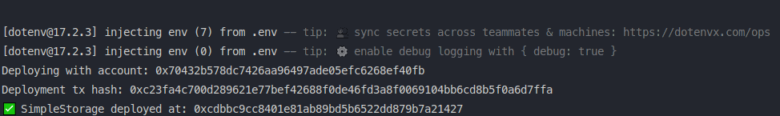
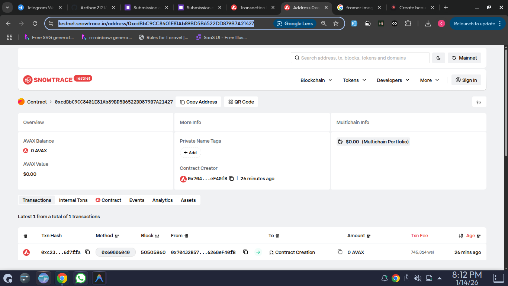

# Day 2 - Smart Contract Deployment

Tugas Day 2 telah berhasil diselesaikan. Berikut adalah detail dari pekerjaan yang telah dilakukan:

## 🚀 Deskripsi Tugas

1.  **Smart Contract Upgrade**: Menambahkan fitur `Ownership` dan `Access Control` menggunakan modifier `onlyOwner` pada contract `SimpleStorage`.
2.  **State Management**: Menambahkan state baru berupa `message` (string) yang bisa diupdate oleh owner.
3.  **Deployment**: Berhasil melakukan deployment ke jaringan **Avalanche Fuji Testnet**.
4.  **Verification Ready**: Contract sudah dikompilasi dan siap untuk digunakan pada integrasi Frontend di Day 3.

## 📋 Detail Deployment

- **Network**: Avalanche Fuji Testnet
- **Contract Address**: `0xcdbbc9cc8401e81ab89bd5b6522dd879b7a21427`
- **Wallet Address**: `0x70432b578dc7426aa96497ade05efc6268ef40fb`

## 📸 Bukti Penyelesaian

Berikut adalah bukti screenshot dari proses deployment dan verifikasi di block explorer:

### 1. Bukti Terminal (Deployment Sukses)

### 2. Bukti di Snowtrace (Block Explorer)

---

_Data ini akan digunakan kembali untuk sesi Day 3 (Frontend Integration)._
